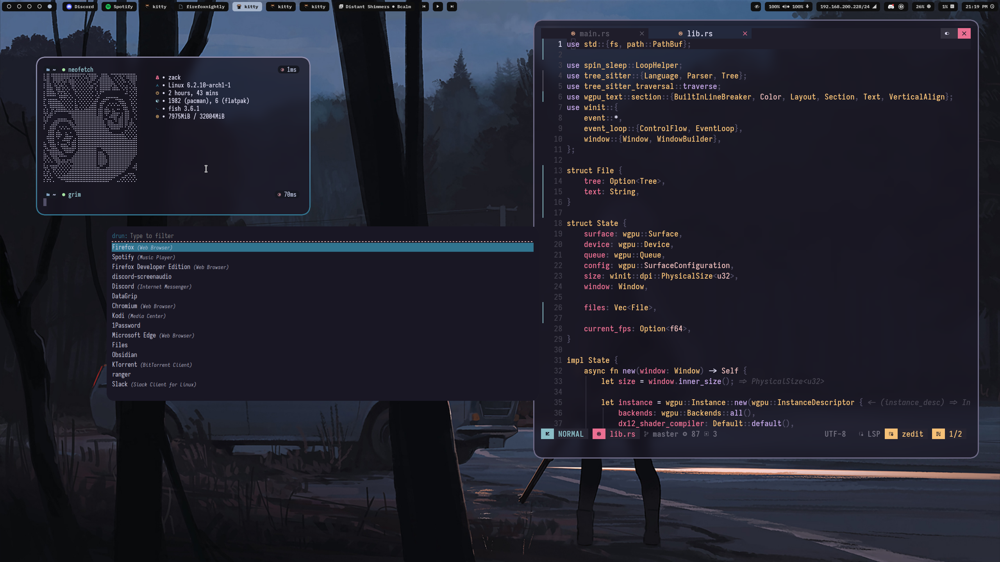

# zackartz dotfiles



To install required dependencies, run this

```bash
paru -S hyprland-nvidia-git waybar-hyprland-git xdg-desktop-portal-hyprland-git xdg-desktop-portal dunst hyprpaper rofi fish kitty neovim tmux
```

A lot of this comes from [1AmSimp1e](https://github.com/1amsimp1e) and their [incredible dotfiles](https://github.com/1amSimp1e/dots) major shoutout and all credit to them!

## Installation
To install copy any configs to their appropriate folder.
This configuration is for nvidia on arch, if you are having issues and you have an nvidia card, please make sure `nvidia-open-dkms` is installed and is below verison 530 (as of writing wayland on nvidia is broken after 525). You can downgrade using the `downgrade` utility on arch.

You can configure monitors on line 11 of `hyprland.conf`.

## NEOVIM
For my custom neovim config, based on NvChad, please check out [this repo](https://github.com/zackartz/nvim-cfg).
